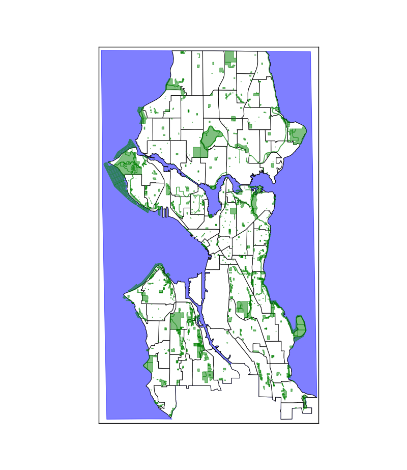

## Plot a map of Seattle in Python

##### This code plots shape files for the city of Seattle using Python's matplotlib and Basemap.  

The general process is as follows:

* Download shape files for the city of Seattle data.seattle.gov

* Read the shape files and parse them into coordinates using fiona

* Initialize a basemap object

* Record shapes in a dataframe and convert to polygon patches using descartes PolygonPatch

* Plot the polygons
